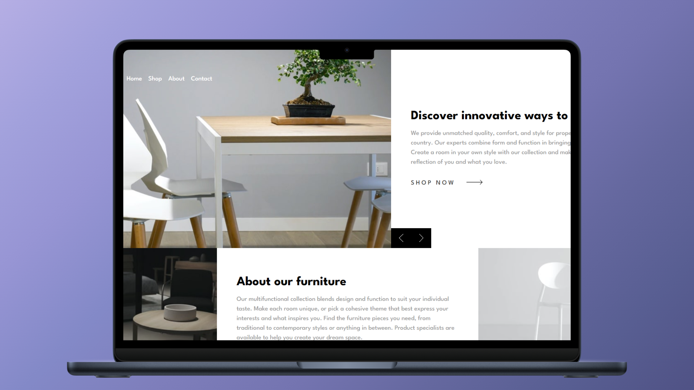

<h1 align="center">Room Homepage 🏡</h1>

<p align="left">
  <a href="README_ES.md" target="_blank">
    Ver README en Español
  </a>
</p>

<p>This repository contains a solution for the Frontend Mentor "Room Homepage" challenge. It’s a project designed to practice complex and responsive grid layouts with CSS.</p>
<hr>

<h1 align="center">Technologies Used</h1>
<div align="center">
  
  
</div>
<hr>

<h1 align="center">Objective</h1>
<ul>
  <li>Improve CSS Grid skills by designing a complex and responsive layout.</li>
  <li>Create a visually attractive and functional homepage following the challenge guidelines.</li>
</ul>
<hr>

<h1 align="center">Main Features</h1>
<ul>
  <li>Responsive design adaptable to different screen sizes, from mobile to desktop.</li>
  <li>CSS Grid used to structure the content in a flexible and semantic way.</li>
  <li>Clean and modern UI following Frontend Mentor guidelines.</li>
</ul>
<hr>

<h1 align="center">Skills Acquired</h1>
<ul>
  <li>CSS Grid to create complex, flexible, and semantic page structures.</li>
  <li>Responsive design with media queries to provide a better experience on different devices.</li>
  <li>Enhanced semantic HTML structure for improved accessibility.</li>
</ul>
<hr>

<h1 align="center">How to Use</h1>

1. Clone this repository to your local machine:

   ```sh
   git clone https://github.com/JordanMedinaOrtiz/room-homepage.git
   cd room-homepage
  
2. Open index.html in your browser.

<p>This challenge was a great opportunity to improve my CSS Grid skills. I'll continue applying these techniques in future projects to grow as a frontend developer.</p>
<p>View the live demonstration <a href="https://jordanmedinaortiz.github.io/room-homepage/" target="_blank">here</a>.</p>

